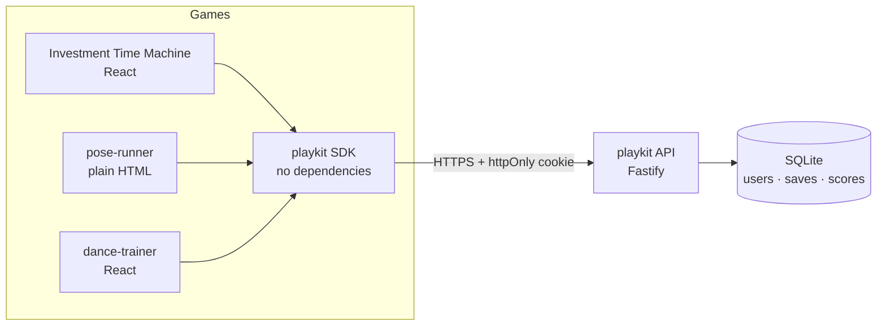

# playkit

[](https://github.com/Chuyuyan/playkit/actions/workflows/ci.yml)

One backend for a shelf of small web games: **accounts, cloud saves, and
leaderboards**, plus a dependency-free browser SDK that any game can drop in.

Built because I had several finished games that all needed the same thing — "let
players sign in and keep their progress" — and none of them deserved their own
backend.

---

## The problem

Static games are easy to ship and impossible to persist. Each of my games
(a React decision-training game, a pose-tracking runner, a dance trainer) is a
frontend with no server, so progress lived in `localStorage`: lost on a browser
change, invisible on a phone, and impossible to rank across players.

Copying an auth implementation into every game would mean three places to get
password hashing wrong. So the goal was one small, correct service and a client
so thin that adding it to a game is a few lines.

## How it works



Each game passes a `gameId`; saves and scores are scoped to `(user, game)`, so
one account works everywhere without games seeing each other's data.

## Design decisions

**Access token in memory, refresh token in an httpOnly cookie.**
The usual shortcut is to keep a long-lived token in `localStorage`, which means
any XSS bug is a permanent account takeover. Here the short-lived (15 min)
access token lives only in a JS variable, and the 30-day refresh token is an
`httpOnly` cookie the page's JavaScript cannot read. The SDK refreshes silently
on the first 401, so games never handle expiry. The browser test asserts both
properties — no token in storage, cookie invisible to `document.cookie`.

**Refresh tokens are rotated and stored hashed.**
Each refresh consumes its token and issues a new one, so a stolen token is
useful only until the real client refreshes once. Only SHA-256 hashes are
stored, so a leaked database yields no usable sessions.

**Optimistic concurrency on saves.**
The same account on a laptop and a phone will eventually write at the same time.
Saves carry a `version`; a write based on stale data gets a `409` with the
current version instead of silently destroying newer progress.

**Login does not reveal whether an email exists.**
Wrong password and unknown account return a byte-identical response, so the
endpoint can't be used to enumerate players. Registration deliberately *does*
say "email already taken" — that leak already exists via login, and the UX cost
of hiding it is real.

**scrypt for passwords, with parameters stored in the hash.**
`scrypt$N$r$p$salt$hash` means cost parameters can be raised later without
invalidating existing passwords. Node's built-in `crypto` does the work, so
there is no native dependency to break on a new Node release.

**SQLite, deliberately.**
For a few thousand players, one file with WAL enabled is faster and simpler than
a Postgres instance, and it uses Node's built-in `node:sqlite` — zero native
builds. The cost is honest: it needs a persistent disk and one writer, so it
does not scale horizontally. The data layer is small enough that moving to
Postgres is a contained change if a game ever outgrows it.

**Rate limits live in the database, not memory.**
An in-memory counter resets on restart, which hands an attacker a fresh budget
every crash. These survive restarts and are prunable.

## Results

Verified end to end, not just unit-tested:

- **36 tests passing** — 19 server tests (`node:test`) plus **17 browser
  assertions** run against the live API from a *different origin*
  (`localhost:5180` → `localhost:4000`), which is the only way to prove CORS,
  cross-origin cookies, and silent refresh actually work.
- The browser suite asserts the security properties directly: session restores
  from the httpOnly cookie in a fresh client, no token reaches `localStorage`,
  a stale save is rejected, and logout revokes the refresh token server-side.

```
17 passed, 0 failed        # examples/smoke-test.html
```

## Tech stack

| Layer    | Tools |
|----------|-------|
| API      | Node 22+, TypeScript, Fastify |
| Auth     | scrypt (`node:crypto`), JWT (`jose`), rotating refresh tokens |
| Database | SQLite via built-in `node:sqlite`, WAL mode |
| SDK      | TypeScript, zero dependencies, bundled with esbuild (~5.8 kB) |
| Tests    | `node:test` + a real-browser cross-origin suite |

## Project structure

```
server/
  src/
    config.ts          # env-driven config, fails loudly on bad prod setup
    app.ts             # Fastify app: CORS allowlist, cookies, routes
    db/index.ts        # schema + connection
    auth/
      password.ts      # scrypt hash/verify
      tokens.ts        # access tokens + rotating refresh tokens
      users.ts         # user lookup/creation, Google linking
      google.ts        # Google ID-token verification via JWKS
      routes.ts        # register/login/refresh/logout/me/google
    games/routes.ts    # saves, scores, leaderboards
    lib/rate-limit.ts  # SQLite-backed attempt limiting
  test/                # server test suites
sdk/src/index.ts       # browser client
examples/              # cross-origin browser smoke test
```

## Running it locally

```bash
# 1. API
cd server
npm install
cp .env.example .env          # optional locally; a dev secret is generated
npm run dev                   # http://127.0.0.1:4000

# 2. SDK
cd ../sdk
npm install && npm run build

# 3. Tests
cd ../server && npm test
```

To run the browser suite, serve the repo root on port 5180 and open
`examples/smoke-test.html` (that origin is allowed by default in dev).

## Using it in a game

```js
import { createPlaykit } from '@playkit/sdk';

const pk = createPlaykit({
  baseUrl: 'https://your-playkit-host',
  gameId: 'investment-time-machine',
  onAuthChange: (user) => renderHeader(user),
});

await pk.restore();                       // resume a previous session, if any
await pk.login(email, password);          // or pk.register(...) / pk.loginWithGoogle(idToken)

const save = await pk.loadProgress();     // { data, version, updatedAt } | null
await pk.saveProgress(state, save?.version);

await pk.submitScore(4200, { board: 'campaign-1' });
const top = await pk.getLeaderboard({ limit: 10 });
```

## API

| Endpoint | Auth | Purpose |
|----------|------|---------|
| `POST /auth/register` | — | Create an account |
| `POST /auth/login` | — | Sign in |
| `POST /auth/google` | — | Sign in with a Google ID token |
| `POST /auth/refresh` | cookie | New access token (rotates refresh) |
| `POST /auth/logout` | cookie | Revoke this session |
| `POST /auth/logout-everywhere` | bearer | Revoke all sessions |
| `GET  /auth/me` | bearer | Current user |
| `PATCH /auth/me` | bearer | Change display name |
| `GET/PUT/DELETE /games/:id/save` | bearer | Cloud save |
| `POST /games/:id/scores` | bearer | Submit a score |
| `GET  /games/:id/leaderboard` | — | Top scores (public) |
| `GET  /games/:id/my-rank` | bearer | Caller's rank |

## Trade-offs & future work

- **No email verification or password reset yet.** Both need an email provider;
  the token plumbing is the easy half. This is the next thing I'd add.
- **Scores are client-reported.** Fine among friends, trivially cheatable by a
  determined player. Server-authoritative scoring would mean replaying game
  logic on the server — a much larger design.
- **SQLite means one writer and a persistent disk** — see the reasoning above.
- **`node:sqlite` is still marked experimental**, though stable in practice on
  Node 22+. Swapping in `better-sqlite3` is a one-file change if that matters.

## License

MIT
